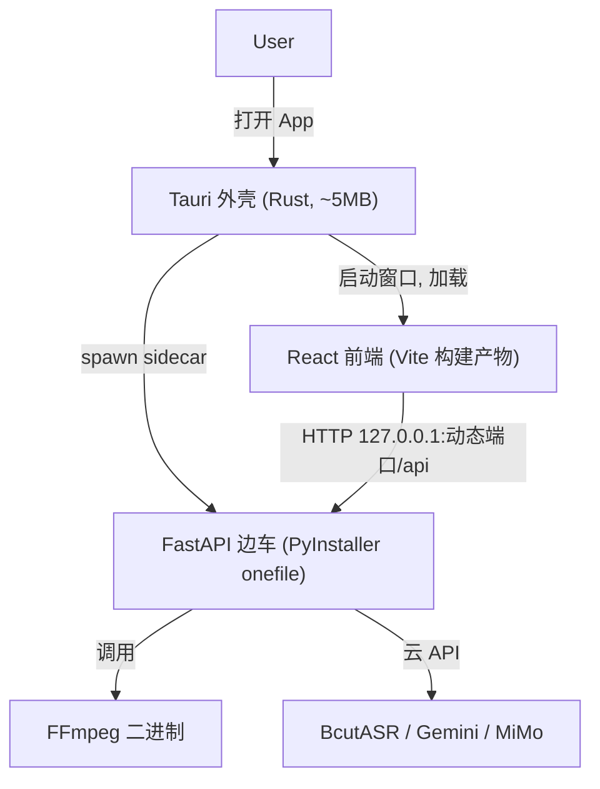

# 桌面端迁移方案：Tauri v2 + Python 边车

## 目标
把 [视频转译](README.md) 从"本地起两个 dev server"的形态，改造成可分发的 Windows / macOS 桌面应用，安装包体积小巧，前后端代码尽量直接复用。第三端（Linux / Web / 移动端）暂不做，但选型保证后续可低成本扩展。

## 架构

- 前端与后端交互协议不变，仍是 HTTP `/api`，只是目标从固定 `localhost:8000` 改为运行时注入的本地端口。
- Tauri 负责：开窗、加载前端、拉起/关闭边车、传递端口。

## 关键改造点

### 1. 前端 API base 改造（改动小但必须）
现在 [app/src/lib/api.ts](app/src/lib/api.ts) 全部硬编码相对路径 `/api/...`，依赖 [app/vite.config.ts](app/vite.config.ts) 的 dev proxy。打包后没有 proxy，需要引入统一 base：
- 新增 `API_BASE`，优先读取 Tauri 注入的端口（如 `window.__API_BASE__` 或环境变量），dev 下回退空字符串（继续用 proxy）。
- 把 `api.ts` 中所有 `fetch('/api/...')`、`getAudioUrl`、`getVideoUrl`、`getExportUrl`、`getThumbnailUrl`、`getVoicePreviewUrl`、`TencentStreamPlayer.tsx` 里的 `/api/...` 统一走 `API_BASE`。

### 2. 新增 Tauri 外壳 `src-tauri/`
- `tauri.conf.json`：应用名、图标、窗口尺寸、`beforeDevCommand`/`beforeBuildCommand` 指向 `app` 的 vite，`frontendDist` 指向 `app/dist`。
- Rust `main.rs`：启动时 spawn 后端 sidecar（分配空闲端口，通过环境变量传给后端），把端口注入前端；应用退出时 kill 边车。
- 配置 sidecar 二进制路径 `src-tauri/binaries/` 与 `externalBin`。

### 3. 后端边车化
- 后端入口从 [server/main.py](server/main.py) 现有 `uvicorn.run(host="0.0.0.0", port=8000)` 改为读取环境变量端口、绑定 `127.0.0.1`（安全）。
- 用 PyInstaller 把 `server` 打成单文件可执行程序（依赖很轻：见 [requirements.txt](requirements.txt)，无 torch 等重型库），放到 `src-tauri/binaries/`，按 Tauri 命名规范加 target triple 后缀。
- 静态挂载 `/files` 与 workspace 目录改为放在用户数据目录（如 `~/Library/Application Support/视译宝`、Windows `%APPDATA%`），避免写到只读安装目录。

### 4. FFmpeg 处理（体积权衡）
- 默认：**首次运行检测系统 FFmpeg，缺失则引导下载**（安装包最小）。
- 备选：内置 FFmpeg 到 `binaries/`（+~50MB，开箱即用）。
- 保留现有 [start.py](start.py) 的检测逻辑思路，迁到后端启动自检 + 前端提示。

### 5. 双端构建
- `npm run tauri build` 在 macOS 出 `.dmg`，在 Windows 出 `.msi/.exe`。
- 交叉编译不可行：最终出双端包需分别在 macOS 和 Windows 上构建，或用 GitHub Actions（仓库已有多平台 CI 基础）矩阵构建。开发调试在当前 macOS 即可。

## 体积预估
- Tauri 外壳 ~5MB + Python 边车 ~30–45MB +（FFmpeg 内置 +50MB 或下载 0）= 约 35–95MB，远小于 Electron。

## 前置依赖
- 本机安装 Rust 工具链（Tauri 必需）、PyInstaller。
- macOS 打包需 Xcode CLT；Windows 打包需 MSVC 构建工具（仅在各自机器上出包时）。

## 不在本次范围
- Linux / Web / 移动端第三端。
- 后端逻辑用 Rust 重写。
- 云端部署 / 用户鉴权。