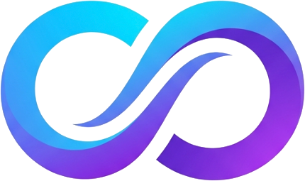
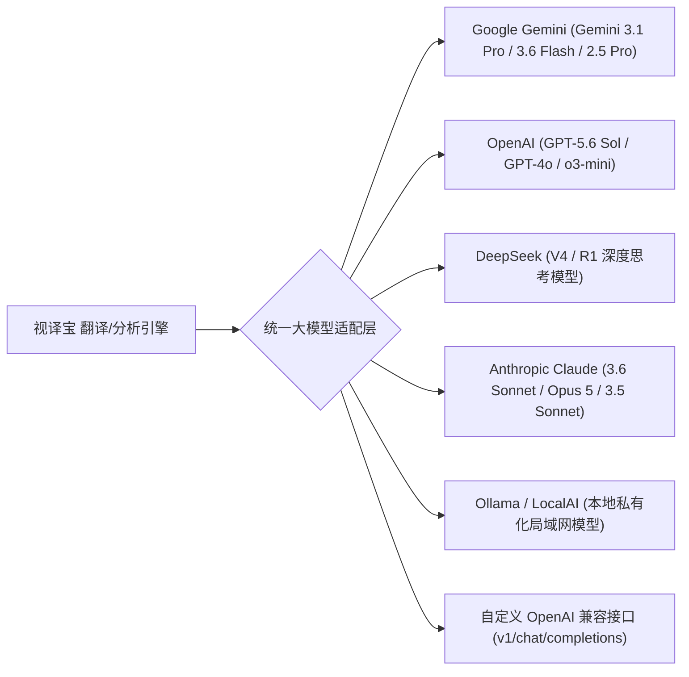
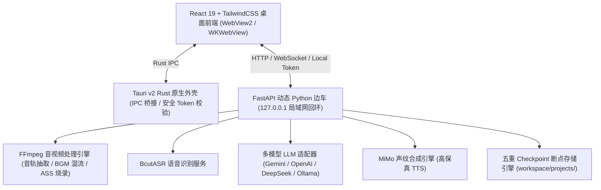

<div align="center">

<br />



# 视译宝 (ShiYiBao) v0.1.8

### 全自动化 AI 视频跨语言转译、多模型智能翻译与原声音色克隆重构工作台

[](https://shiyibao-web.vercel.app/)
[](https://github.com/deijing/shiyibao)
[](https://github.com/deijing/shiyibao/releases)
[](LICENSE)
[](https://github.com/deijing/shiyibao/releases)
[](https://tauri.app)
[](https://react.dev)
[](https://fastapi.tiangolo.com)

[🌐 **官方网站**](https://shiyibao-web.vercel.app/) • [📖 快速开始](#-快速开始) • [✨ 核心特性](#-核心特性) • [🧠 适配 AI 大模型](#-适配-ai-at-大模型) • [🌐 多语言翻译](#-多语言全语种互译) • [🏗️ 系统架构](#-系统架构) • [⚙️ 配置说明](#%EF%B8%8F-配置说明)

</div>

---

> [!IMPORTANT]
> **视译宝 (ShiYiBao)** 是一款为视频创作者、跨国学习者与内容团队打造的全自动化 AI 视频转译与重构工作台。上传任意视频，系统自动完成**音轨分离、高精度 ASR 识别、多大模型语义重构翻译、MiMo 高保真声纹克隆配音、FFmpeg 时间轴对齐与 BGM 自动混流**，最终导出全高清带中外双语字幕的定制成片与字幕文件！

---

## ✨ 核心特性

<div justify="center">

| 特性分类 | 核心亮点与技术优势 |
| :--- | :--- |
| **🌐 全语种双向互译** | 支持 **英文 ⇄ 中文**、日/韩/法/德/西/俄等全球主要语种任意互相重构转译，自动保持上下文标点与口语化表达 |
| **🧠 多 AI 大模型生态** | 深度集成 **Gemini 3.1 Pro / 3.6 Flash**、**OpenAI (GPT-5.6 Sol / GPT-4o)**、**DeepSeek (V4 / R1 深度推理)**、**Claude 3.6 Sonnet**、**MiMo**、**Ollama 私有大模型** 与标准自定义 API |
| **🎙️ 声纹克隆与配音** | 小米 MiMo 多音色高保真 TTS 语音合成，内置冰糖、甜美、沉稳、男声、英文等多角色预设库，FFmpeg 智能保留原片 BGM |
| **🖥️ 独立双卡片工作台** | 16:9 原画视频主卡片 + 独立白底字幕/AI 学习卡片 (`gap-5` 优雅分离)，支持字幕实时滑动居中跟随定位 |
| **💬 交互式 AI 问答助教** | 内置高对比度 `MarkdownRenderer`，提供结构化**核心摘要**、**学习大纲**与**交互式 AI 字幕对话流 (Chat Thread)** |
| **⚡ 60fps 极速性能引擎** | 15fps 时间同步防抖节流阀 + SVG 波形 `useMemo` 预计算 + `React.memo` 增量卡片刷新，播放流畅零掉帧 |
| **🛡️ 断点续传与 AIMD 控速** | 5 重 Checkpoint 检查点秒级复用 (音轨/ASR/翻译/切片/成片)，AIMD 动态自适应控速器防御 429 限流 |
| **📦 跨平台原生桌面** | 基于 Tauri v2 + PyInstaller 动态 FastAPI 边车，原生适配 macOS (Apple Silicon/Intel) 与 Windows 10/11 |

</div>

---

## 🧠 适配 AI 大模型

视译宝不再局限于单一服务商，全新引入统一的大模型适配层 (Unified LLM Adapter)，无缝对接云端与本地私有大模型：



> [!TIP]
> **智能退避与多 Key 轮换机制**：当 AI 大模型服务遭遇 429 Rate Limit (请求过载) 时，系统将自动触发 AIMD (加性增大/乘性减小) 拥塞控制算法，配合指数退避与多 API Key 自动轮换，确保百页长视频转译 100% 稳健完成。

---

## 🌐 多语言全语种互译

视译宝支持全球主流语种之间的无缝双向转译与语义重构，完美解决跨国学习与海外视频本地化痛点：

- **🇨🇳 中文 ⇄ 🇺🇸 英语**（支持美音/英音自然音色配音）
- **🇨🇳 中文 ⇄ 🇯🇵 日语**（ACG 动漫与日剧口语化优雅重构）
- **🇨🇳 中文 ⇄ 🇰🇷 韩语**（影视与综艺自然口语转译）
- **法语 / 德语 / 西班牙语 / 俄语 / 意大利语 / 葡萄牙语 / 阿拉伯语** 等多语种全方位覆盖。

---

## 🖥️ 独立双卡片 60fps 极速工作台

界面采用现代化 SaaS 独立卡片分离设计，左侧为经典 **16:9 原画视频制作区**，右侧为 **白底高对比字幕与 AI 智能卡片**：

|  16:9 原画视频主制作区 | 📝 独立白底字幕与 AI 学习卡片 |
| :--- | :--- |
| • **实时流式秒开播放器**：支持 4K 原画流畅播放<br>• **音视频多轨时间轴**：V1 (视频) / S1 (字幕) / A1 (原音) / A2 (配音)<br>• **180 根 SVG 动态声纹**：预渲染声纹图，播放毫秒级对齐 | • **标签 1 (双语字幕列表)**：支持双语/译文/原文切换与滑动居中跟随<br>• **标签 2 (AI 学习大纲)**：一键提炼核心摘要与结构化知识大纲<br>• **标签 3 (AI 问答助教)**：交互式连续对话流 (Chat Thread) |

> [!NOTE]
> **字幕导出格式支持**：支持一键导出包含精准时间戳的 **`.srt`**、**`.vtt`**、**`.txt`**、**`.json`** 文本以及一键复制全量字幕交由第三方 AI 深度分析。

---

## 🏗️ 系统架构

视译宝采用 **Tauri v2 + FastAPI PyInstaller 边车** 的先进桌面与 Web 双模架构：



---

## 🚀 快速开始

### 🤖 AI Agent 一键部署 (Recommended)

如果您使用的是 **Cursor、Claude Code、Windsurf、Bolt、Roo Code** 或任意 AI 编程 Agent，只需复制以下指令直接发给您的 AI Agent，即可全自动完成依赖安装与服务拉起：

```text
请按照以下步骤为我全自动初始化、安装依赖并启动【视译宝 ShiYiBao】音视频AI翻译应用：

1. 检测与安装依赖：
   - 检查项目根目录是否存在 Python 虚拟环境 `.venv`；若不存在，运行 `python3 -m venv .venv` 创建。
   - 激活 `.venv` 并安装 Python 后端依赖：运行 `. .venv/bin/activate && pip install -r requirements.txt`。
   - 进入 `app/` 目录，安装前端 Node 依赖：运行 `cd app && npm ci`。

2. 检查系统基础设施：
   - 确认系统 PATH 中已包含带 libass 字幕渲染支持的 FFmpeg 和 Node.js (>=20.19 或 >=22.12)。

3. 启动双模服务：
   - 在已激活的 Python 虚拟环境下，从根目录运行一键启动脚本：
     . .venv/bin/activate && python start.py
   - 说明：`start.py` 会在后台同时守护拉起 FastAPI 后端 (http://127.0.0.1:8000) 与 React Vite 前端 (http://127.0.0.1:5173)。

4. 自动验证与交付：
   - 执行 Curl 健康检查验证后端状态：`curl -s http://127.0.0.1:8000/api/health`
   - 确认返回 {"status":"ok", ...} 并且 Vite 准备就绪后，向我汇报部署完成，并输出前端入口：http://127.0.0.1:5173/。
```

### 🛠️ 手动环境准备

建议环境要求：
- **Python**: 3.10 – 3.14（推荐 3.12）
- **Node.js**: 20.19+ 或 22.12+
- **FFmpeg**: 6.0+（必须包含 `libass`、`libx264` 与 `aac` 支持）
- **Rust**: 1.77.2+（仅桌面端打包 / 本地开发需要）

#### 1. 安装 FFmpeg

- **macOS (Homebrew)**:
  ```bash
  brew tap homebrew-ffmpeg/ffmpeg
  brew install homebrew-ffmpeg/ffmpeg/ffmpeg
  ```

- **Windows (WinGet)**:
  ```powershell
  winget install Gyan.FFmpeg
  ```

- **Ubuntu / Debian**:
  ```bash
  sudo apt update && sudo apt install ffmpeg -y
  ```

#### 2. 克隆仓库与安装依赖

```bash
# 1. 克隆开源仓库
git clone https://github.com/deijing/shiyibao.git
cd shiyibao

# 2. 安装后端 Python 依赖
python3 -m venv .venv
source .venv/bin/activate  # Windows: .venv\Scripts\Activate.ps1
pip install --upgrade pip
pip install -r requirements.txt

# 3. 安装前端 React 依赖
cd app
npm ci
cd ..
```

#### 3. 配置密钥 (.env)

复制 `.env.example` 并填入您的 API 密钥：

```bash
cp .env.example .env
```

在 `.env` 中配置相关 Key（也可启动后在应用设置面板中图形化配置）：

```dotenv
# 多模型 API Key 配置
GEMINI_API_KEY=your_gemini_api_key_here
OPENAI_API_KEY=your_openai_api_key_here
DEEPSEEK_API_KEY=your_deepseek_api_key_here

# 小米 MiMo 语音合成 Key
MIMO_API_KEY=your_mimo_api_key_here
```

#### 4. 启动应用

**一键跨平台启动**：

```bash
python start.py
```

快捷启动入口：
- **macOS / Linux**: `./start.sh`
- **Windows**: 双击运行 `start.bat`

应用启动后将提供以下服务地址：
- 🌐 **Web 控制台**: `http://localhost:5173`
- 📚 **Interactive API Docs**: `http://localhost:8000/docs`
- 🩺 **Health Check**: `http://localhost:8000/api/health`

---

## 📦 桌面端打包 (Tauri v2)

打包生产环境原生桌面安装包 (`.dmg` / `.exe`)：

```bash
# 1. 安装构建依赖
pip install -r requirements-build.txt

# 2. 桌面开发预览模式
npm run desktop:dev

# 3. 打包当前平台原生安装包 (DMG / NSIS EXE)
npm run desktop:build
```

构建产物位置：
- **macOS**: `src-tauri/target/release/bundle/dmg/`
- **Windows**: `src-tauri/target/release/bundle/nsis/`

---

## ⚙️ 配置说明

| 环境变量 | 默认值 | 作用与说明 |
| :--- | :---: | :--- |
| `GEMINI_API_KEY` | 空 | Google Gemini 大模型 API Key |
| `OPENAI_API_KEY` | 空 | OpenAI / DeepSeek / 兼容大模型 Key |
| `MIMO_API_KEY` | 空 | 小米 MiMo 高保真 TTS 合成 Key |
| `MAX_CONCURRENT_TASKS` | `4` | 后端最大并行处理任务数 (1–12) |
| `TRANSLATE_CONCURRENCY` | `3` | AI 翻译并发分段数 (1–8) |
| `TTS_CONCURRENCY` | `6` | MiMo 语音合成并发数 (1–16) |
| `SUBTITLE_FONT` | `Arial` | ASS 硬字幕烧录字体名称 |
| `SHIYIBAO_PORT` | `8000` | 后端 API 监听端口 (桌面端自动动态分配) |
| `SHIYIBAO_DATA_DIR` | 用户数据目录 | 任务元数据、断点文件与工程目录保存位置 |

---

## 🔒 本地安全与隐私保障

1. **绝对本地闭环**：视译宝默认仅监听 `127.0.0.1` 回环网络，不向公网暴露开放端口。
2. **多重安全防线**：所有 API 接口带精细 `Origin` / `Referer` 域名白名单校验与 Tauri 动态令牌 (`X-Shiyibao-Local-Token`) 保护，严格防止任何恶意网页窃取本地 API 密钥。
3. **数据隐私控制**：任务视频、字幕工程与生成的成片均存储在本地系统用户数据目录 (`~/Library/Application Support/yishibao` 或 `%APPDATA%\com.shiyibao.desktop`)，可随时一键彻底抹除。

---

## 📄 开源许可证

本项目基于 [MIT License](LICENSE) 开源发布。欢迎提交 Issue 与 Pull Request 共同建设！

---

<div align="center">

**🌟 如果视译宝对您的学习或创作有所帮助，欢迎在 GitHub 上点个 Star 支持我们！**

[https://github.com/deijing/shiyibao](https://github.com/deijing/shiyibao)

</div>
